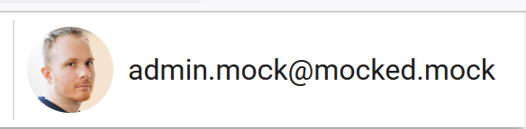
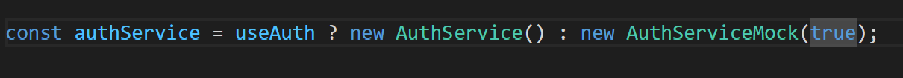
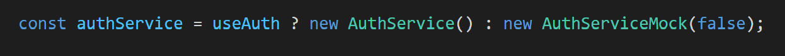

# Demo BBL Security 

## Deploying

### Pre-requisites 

+ Docker **OR** the Go toolchain to execute `app-cli`
+ Terraform
+ AZ CLI
+ NodeJS to execute the frontend in local


### Setting it up
First, fork the repository, CI will fail for the moment, it's expected.

Next, clone your fork and execute `./deploy.ps1` at the root of the directory. This will :
+ Deploy the infrastructure using Terraform
+ Link the created functionapp to the created static webapp using the Bring Your Own Function feature
+ Retrieve the connections string required to deploy the apps 
    + **AZURE_STATIC_WEB_APPS_API_TOKEN** is required to deploy the `frontend` directory to an Static Web App
    + **AZURE_FUNCTIONAPP_PUBLISH_PROFILE** is required to deploy the `function-keyvault-relay` to a functionapp

These two variables must be added as **SECRETS** in your fork.
You can then trigger the CI again, using Github **Rerun All Jobs** feature or by pushing a new commit into your fork. This should deploy all the required code to the created resource group.

The last step is to navigate in the Azure portal to the created Keyvault.

You must created a secret named `adminOnly` with any value. This will be used in the third and last part of the demo.

## Running the demo

The purpose of this specific demo is to show three ways to authenticate to Azure
+ External scipt to Azure service -> Using a Service Principal 
+ Users to Azure service -> Using Static Web App managed authentification
+ Azure servcie to Azure service -> Using managed identities


### Using a service principal

The `app-cli` directory contains an App written in Go. The purpose of this app is to list all resource groups in the user subscription. This app shows the use of a service principal in a script, using Azure GO SDK to make the process as painless as possible.

This approach is tackled first because it's the obvious one for a developper. It's only used as an introduction, as the purpose of this demo is to show a more managed approach

To execute the Go program, you can either use Docker
```sh
cd app-cli
docker build -i cli-app .
docker run -it cli-app
```
or if you have the Go toolchain installed
```sh
cd app-cli
go build
./app-cli.exe
```

### Using a Static Web App with the managed authentication layer

The Service principal approach is developer-centric. There's no decoupling between the core app functionality and the authentication layer. The main downside of this developper-centric approach is that the developer has to maintain both its own code and the auth layer. 

But "managed services" are a big selling point of the public Cloud, so this second part is using Static Web App managed authentication layer.

This part of the demo will include the following :
- Showing that the development version of the app. The main points are:
    + It doesn't include any authentication layer
    + There are two types of users roles. "user" and admins

To build the local version:

```sh
cd frontend
# Install node dependencies
npm install
# Launch the website local version on :8080
npm run serve
```

This local frontend version is using mocks. It is made this way to allows to easily switch between an `admin` role and `user` role. 



To switch between the admin view and user view, while the app is running, you can change the following in `frontend/src/inversify.config.ts` 




to 




Next, 

